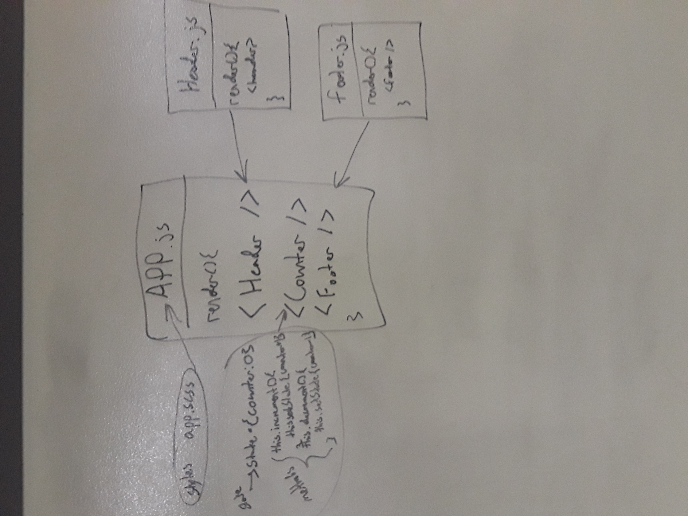

# Lab27 - React Testing and Deployment
Lab to practice writing React component tests with Enzyme and deploying to Netlify and AWS
### Author: Chris Kozlowski

### Links and Resources
* [Submission PR](https://github.com/401-advanced-javascript-cdk/lab-26-component-based-ui/pull/1)
* [Netlify Deployment]( --- )
* [AWS Deployment] ( --- )

### Modules
#### `index.js`
Gets the root element in the HTML and renders the App component
#### `app.js`
Imports the Header, Footer, and Counter components.  The App component renders all three components.
#### 'components/counter.js`
Contains the Counter component with a count integer in state and methods for increasing and decresing the count.  The Counter component has links that trigger the methods when clicked.
#### `components/header.js`
Dummy component that renders the header.
#### `component/footer.js`
Dummy component that renders the footer.
#### `app.scss`
Defines the styling for the app.

#### Operation
The app can be viewed at the deployments listed above.

#### UML

